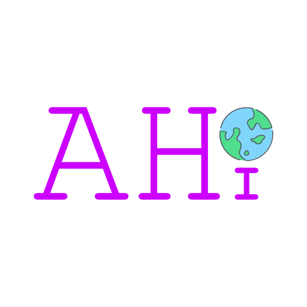

<h1 align="center">
   
  
   
  Algarve's Human Intelligence: Tech blog
   
</h1>

Call for contributions, always happy to have you. Several design principles are at hand:
- Pick a topic close to your 
- GH repo with all the codes should be delivered together with the text
  - we would like to host it, but it is not necessary
- Please suggest a reviewer for your contribution, which will be mentioned 
- Provide short bio, photo and all handles people interested can contact.

### Original full README from the `sveltekit-tailwind-blog-starter` can be found [here](https://github.com/akiarostami/sveltekit-tailwind-blog-starter)

<h4 align="center">An easily configurable and customizable blog starter for <a href="https://kit.svelte.dev" target="_blank">SvelteKit</a> + <a href="https://tailwindcss.com" target="_blank">Tailwind CSS</a>.</h4>

  
  
  
  
  
  

